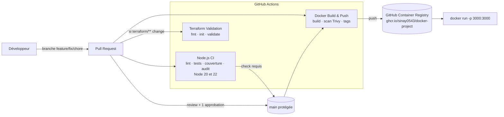

# DevOps Platform Challenge — Task API

[](https://github.com/Sinay0543/docker-project/actions/workflows/node-ci.yml)
[](https://github.com/Sinay0543/docker-project/actions/workflows/docker.yml)
[](https://github.com/Sinay0543/docker-project/actions/workflows/terraform.yml)

Petite API Node.js/Express de gestion de tâches, utilisée comme support pour mettre en place une chaîne DevOps complète :

**Issue → Branche → Code → Pull Request → Review → Approbation → Merge → CI → Conteneur → Registry → Validation Terraform**

Projet réalisé en équipe de 4 dans le cadre du cours de plateforme dev (ISEN Méditerranée).

---

## Sommaire

1. [Objectif du projet](#objectif-du-projet)
2. [Architecture](#architecture)
3. [API](#api)
4. [Installation locale](#installation-locale)
5. [Tests et qualité](#tests-et-qualité)
6. [Docker](#docker)
7. [CI/CD](#cicd)
8. [Terraform](#terraform)
9. [Workflow de développement](#workflow-de-développement)
10. [Commandes utiles](#commandes-utiles)
11. [Équipe](#équipe)

---

## Objectif du projet

L'application de départ contenait un défaut (calcul de total erroné) qui faisait échouer un test automatisé. L'objectif était de :

- corriger ce défaut sans affaiblir les tests ;
- ajouter une API de tâches (lister, créer, compléter, supprimer), chaque fonctionnalité étant développée par un membre différent ;
- mettre en place un workflow GitHub professionnel (issues, branches, PR, reviews, protection de `main`) ;
- automatiser les tests, la construction et la publication de l'image Docker, ainsi que la validation Terraform.

---

## Architecture



### Structure du dépôt

```text
.
├── src/
│   └── app.js                 # Application Express + store de tâches en mémoire
├── test/
│   ├── app.test.js            # Tests unitaires de calculateTotal
│   ├── patch.test.js          # Tests de PATCH /tasks/:id (200, 400, 404)
│   ├── routes.test.js         # Tests des routes /, /health, /total
│   └── tasks.test.js          # Tests HTTP de l'API /tasks
├── terraform/
│   └── main.tf                # Configuration Terraform (sans provider cloud)
├── .github/
│   ├── workflows/
│   │   ├── node-ci.yml        # Lint, tests, couverture, audit (Node 20 + 22)
│   │   ├── docker.yml         # Build, scan, tag et push vers GHCR
│   │   └── terraform.yml      # fmt -check, init, validate
│   ├── ISSUE_TEMPLATE/        # Templates bug / fonctionnalité
│   └── pull_request_template.md
├── Dockerfile
├── .dockerignore
├── .gitignore
└── package.json
```

### Choix techniques

- **Express 4** et un **store en mémoire** (`tasks`, `nextId`) : aucune base de données n'est nécessaire pour le challenge. Les données sont perdues au redémarrage.
- Le tableau `tasks` est **exporté** pour que les tests puissent le vider avant chaque test (`beforeEach`) et rester indépendants.
- Les tests utilisent le **test runner natif de Node** (`node:test`) et `fetch` : aucune dépendance de test supplémentaire.

---

## API

Base URL locale : `http://localhost:3000`

| Méthode | Route | Description | Réponses |
|---|---|---|---|
| GET | `/` | Informations sur le service | 200 |
| GET | `/health` | Healthcheck (utilisé par Docker) | 200 |
| GET | `/total` | Total d'un panier d'exemple | 200 |
| GET | `/tasks` | Liste toutes les tâches | 200 |
| POST | `/tasks` | Crée une tâche `{ "title": "..." }` | 201, 400 si titre vide ou invalide |
| PATCH | `/tasks/:id` | Met à jour `{ "completed": true }` | 200, 400 si entrée invalide, 404 si tâche inconnue |
| DELETE | `/tasks/:id` | Supprime une tâche | 204, 404 si tâche inconnue |

Une tâche a la forme suivante :

```json
{ "id": 1, "title": "Apprendre Docker", "completed": false }
```

Exemples :

```bash
curl http://localhost:3000/tasks
curl -X POST http://localhost:3000/tasks -H "Content-Type: application/json" -d '{"title":"Apprendre Docker"}'
curl -X PATCH http://localhost:3000/tasks/1 -H "Content-Type: application/json" -d '{"completed":true}'
curl -X DELETE http://localhost:3000/tasks/1
```

---

## Installation locale

Prérequis : **Node.js 20 ou plus**, npm, Git (et Docker pour la partie conteneur).

```bash
git clone https://github.com/Sinay0543/docker-project.git
cd docker-project
npm ci
npm start
```

L'application écoute sur le port `3000` (modifiable avec la variable d'environnement `PORT`).

---

## Tests et qualité

```bash
npm test               # tous les tests (node --test)
npm run test:coverage  # tests + rapport de couverture
npm run lint           # ESLint (guillemets doubles, points-virgules, variables inutilisées)
npm audit              # vulnérabilités des dépendances
```

Règles d'équipe :

- chaque fonctionnalité arrive avec ses tests (cas nominal et cas d'erreur 400/404) ;
- on ne supprime ni n'affaiblit jamais un test pour rendre la CI verte ;
- les tests HTTP démarrent l'application sur un port libre (`app.listen(0)`) pour ne jamais entrer en conflit avec une instance déjà lancée.

---

## Docker

### Construire et lancer

```bash
docker build -t devops-platform-challenge .
docker run --rm -p 3000:3000 devops-platform-challenge
```

### Utiliser l'image publiée

```bash
docker pull ghcr.io/sinay0543/docker-project:latest
docker run --rm -p 3000:3000 ghcr.io/sinay0543/docker-project:latest
```

### Bonnes pratiques appliquées

- image de base légère `node:20-alpine` ;
- copie de `package*.json` avant le code pour profiter du cache des couches ;
- installation des seules dépendances de production (`npm ci --omit=dev`) ;
- exécution avec l'utilisateur **non-root** `node` ;
- `HEALTHCHECK` sur `/health` ;
- lancement direct de `node` (et non `npm start`) pour que le conteneur reçoive correctement `SIGTERM` ;
- `.dockerignore` qui exclut tests, Terraform, Git et fichiers locaux de l'image.

---

## CI/CD

Trois workflows GitHub Actions dans `.github/workflows/` :

| Workflow | Déclencheurs | Étapes |
|---|---|---|
| **Node.js CI** (`node-ci.yml`) | PR vers `main`, push sur `main` | checkout → Node 20 et 22 (matrice, cache npm) → `npm ci` → lint → tests + couverture → `npm audit`. Un job final `test` agrège la matrice : c'est le **check requis** par la protection de `main`. |
| **Docker Build & Push** (`docker.yml`) | PR vers `main`, push sur `main`, tags `v*` | checkout → Buildx → calcul des tags → build → scan **Trivy** → login GHCR → push. Sur une PR, l'image est construite et scannée mais **pas publiée**. |
| **Terraform Validation** (`terraform.yml`) | changement de `terraform/**` ou du workflow, lancement manuel | `terraform fmt -check -recursive` → `terraform init -backend=false` → `terraform validate` |

Tags d'image publiés sur `ghcr.io/sinay0543/docker-project` :

- `latest` : dernier commit de `main` ;
- `sha-<commit>` : chaque build, pour revenir à une version précise ;
- `X.Y.Z` : quand un tag Git `vX.Y.Z` est poussé.

### Quality gate

La branche `main` est protégée :

- pull request obligatoire (pas de push direct) ;
- **1 approbation minimum** d'un autre membre ;
- **check `test` (Node.js CI) obligatoire**.

Démonstration réalisée (PR #20) : une PR introduisant volontairement une régression fait échouer la CI et le bouton Merge reste bloqué ; une fois corrigée, la CI passe, un coéquipier approuve et la PR peut être mergée.

---

## Terraform

Le dossier `terraform/` contient une configuration **sans provider cloud** : aucune ressource n'est déployée. Elle déclare une variable (`application_name`), des `locals` et un `output` de métadonnées.

Le but est uniquement de **valider** la configuration en CI :

```bash
cd terraform
terraform fmt -check -recursive
terraform init -backend=false
terraform validate
```

`-backend=false` évite toute configuration d'état distant, puisqu'il n'y a pas de cloud. Aucun identifiant cloud n'est utilisé ni stocké dans le dépôt.

---

## Workflow de développement

### Stratégie de branches

```text
main                      # toujours stable et déployable, protégée
 ├── feature/<sujet>      # nouvelle fonctionnalité   ex. feature/issue-1-get-tasks
 ├── fix/<sujet>          # correction de bug         ex. fix/repair-main
 ├── chore/<sujet>        # outillage, CI, config     ex. chore/terraform-ci-and-feature-template
 └── docs/<sujet>         # documentation             ex. docs/readme
```

Chaque branche a **un seul objectif**, part de `main` à jour et est supprimée après le merge.

### Cycle d'une modification

1. **Issue** : créée avec le template (bug ou fonctionnalité), avec critères d'acceptation, et assignée.
2. **Branche** : `git checkout main && git pull`, puis `git checkout -b feature/...`.
3. **Code et tests** : `npm test` et `npm run lint` doivent passer en local.
4. **Commits** : messages explicites au format *Conventional Commits* (`feat:`, `fix:`, `chore:`, `test:`, `docs:`).
5. **Pull Request** : template rempli (description, `Closes #<issue>`, tests, checklist).
6. **Review** : au moins un coéquipier relit et laisse une remarque technique ; les retours sont corrigés avant le merge.
7. **Merge** : uniquement si la CI est verte et la PR approuvée.

---

## Commandes utiles

```bash
# Application
npm ci                         # installer les dépendances (version exacte du lockfile)
npm start                      # lancer l'API sur le port 3000
PORT=8080 npm start            # changer de port

# Qualité
npm test
npm run test:coverage
npm run lint
npm audit

# Docker
docker build -t devops-platform-challenge .
docker run --rm -p 3000:3000 devops-platform-challenge
docker ps                      # voir l'état du healthcheck

# Terraform
terraform -chdir=terraform fmt -check -recursive
terraform -chdir=terraform init -backend=false
terraform -chdir=terraform validate

# Git
git checkout main && git pull origin main
git checkout -b feature/ma-fonctionnalite
git push -u origin feature/ma-fonctionnalite
```

---

## Équipe

| Membre | Contributions principales |
|---|---|
| Yanis (Sinay0543) | Correction du défaut initial, Dockerfile et pipeline Docker, pipeline Terraform, templates GitHub, DELETE `/tasks/:id` |
| Nizar (Nizar835) | GET `/tasks`, réparation de la CI Node et de `main`, `.gitignore`, déclenchement de la CI Terraform, validation de PATCH, durcissement CI/Docker, README |
| Ayman (Aymank83) | POST `/tasks` |
| Mohamed (Momo-835) | PATCH `/tasks/:id`, démonstration du quality gate |

Chaque membre a relu et approuvé au moins une Pull Request d'un autre membre.
